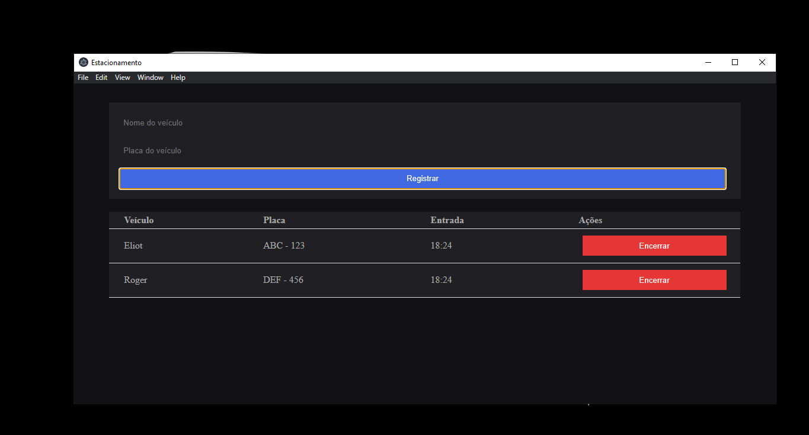

<p align="center">
  
</p>

<h1 align="center">:camera_flash: Screenshots</h1>

<div align="center">
  <h2 align="center">Desktop</h2>
  
</div>

## :gear: Requisítos

- [X] [Node.js](https://nodejs.org/en/) ( Obrigatório )
- [X] [GIT](https://git-scm.com/) ( Opcional )

## :rocket: Tecnologias

- [x] [Node.js](https://nodejs.org/en/)
- [x] [Electron](https://www.electronjs.org/)

## :computer: Projeto

Um simples gerenciador de estacionamento para desktop.

## :bookmark_tabs: Ideias de implementação

- [ ] Refatoração
- [ ] Melhorar o layout
- [ ] Corrigir bugs

## :open_file_folder: Estrutura de diretórios

```
projeto
  |-- .github 
  |-- public
    |-- index.html
    |-- style.css
    |-- main.js
  |-- src
    |-- config.js
    |-- index.js
  |-- .gitignore
  |-- LICENSE.md
  |-- package.json
  |-- README.md
```

## :arrow_down: Instalação

- `git clone https://github.com/roger3g/parking-manager.git`;
- `cd parking-manager`;
- `npm install`;
- `npm start`.

## :thinking: Como contribuir

- Faça um fork desse repositório;
- Cria uma branch com a sua feature: `git checkout -b minha-feature`;
- Faça commit das suas alterações: `git commit -m 'feat: Minha nova feature'`;
- Faça push para a sua branch: `git push origin minha-feature`.

Depois que o merge da sua pull request for feito, você pode deletar a sua branch.

## :memo: Licença

Esse projeto está sob a licença MIT. Veja o arquivo [LICENSE](LICENSE.md) para mais detalhes.
